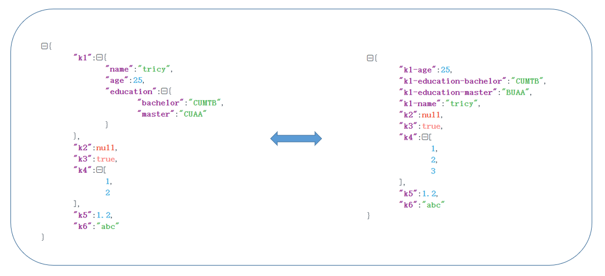

# gojson
背景：在使用go语言处理json深层嵌套和key-value结构相互转化时没有找到合适的包，于是自己写了一个。

功能：gojson包提供json数据打平成key-value结构，和key-value结构组合成json结构。

关键词：json，keyvalue，js，kv，js2kv，json2kv，json2keyvalue

图示：



Js2kv

​	原理：递归解析json。

```
package main

import (
	"fmt"
	"github.com/tricychow/gojson"
)
const s = `{"name":{"first":"Janet","last":"Prichard"},"age":47}`
func main(){
	x, _ := gojson.Js2kv(s, "_")
}
// result:{"age":47,"name_first":"Janet","name_last":"Prichard"}
```

Kv2js

​	原理：拆分多级key，类型强转。

```
package main

import (
	"fmt"
	"github.com/tricychow/gojson"
)
const s = `{"age":47,"name_first":"Janet","name_last":"Prichard"}`
func main(){
	x, _ := gojson.Kv2js(s, "_")
	fmt.Println(x)
}
// result:{"age":47,"name":{"first":"Janet","last":"Prichard"}}
```

